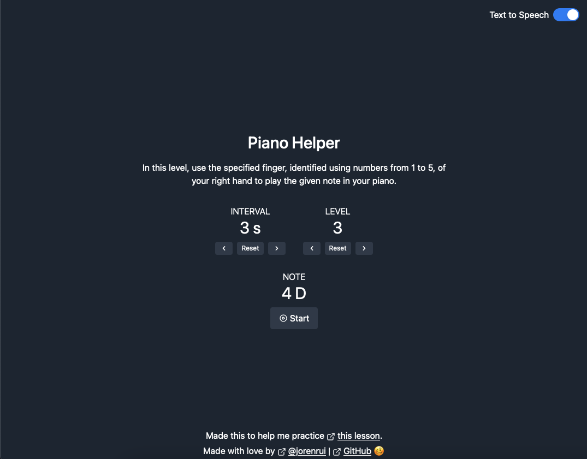

# Piano Lesson Helper

Hello 👋

Wanting to learn piano, I decided to buy an electronic keyboard this Nov 2021. Currently, I'm trying out [this piano tutorial](https://www.youtube.com/watch?v=QBH6IpRkVDs). Going through it, I decided to make this app to help me practice.

